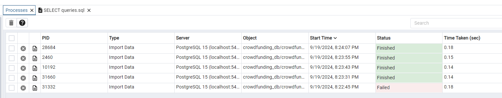

# Crowdfunding ETL Project

This is a readme for Crowdfunding ETL Project (Project 2).
The project team consists of:
- Selina Taleb
- Ashish Pal Singh

The instructions for this mini project are divided into the following subsections:
1- Create the Category and Subcategory DataFrames
2- Create the Campaign DataFrame
3- Create the Contacts DataFrame
4- Create the Crowdfunding Database

1- Create the Category and Subcategory DataFrames

we started with two datasets the crowdfunding campagin data and the contact information data. We seperated the category from the subcategory into their own columns. We split the columns into 2 new ones: category, and subcategory. We got the unique categories and subcategories in separate lists, and the number of distinct values using the len function. We then generated unique IDs for each category and subcategory to create sequences of numbers and we combined these IDs with car for category and subcat for subcategory. We created seperate DataFrames and then saved these two as CSV files under category.csv and subcategory.csv 

2- Create the Campaign DataFrame

In step 2, we create a campaign DataFrame from the crowdfunding dataframe. We renamed the blurb column to description, launched_at, to launch_date, and deadline to end_date. 
We then converted the goal and pledged columns to float data types using the astype formula because they represent money values. We also converted the launch_date and end_date columns to proper date formats using pd.to_datetime().
We then merged campaign data with categy and subcategry on their common columns (category and subcategory). We dropped unwanted columns, so we cleaned the data and renamed the DataFrame to campaign_cleaned. Finally, we exported it as a CSV file under campaign.csv

3- Create the Contacts DataFrame

In step 3, we used Pandas to create the contacts DataFrame. The contact data was stored as a JSON string so we used the json module to turn each string into a Python dictionary. From that, we created a DataFrame that had 3 columns: contact_id, name, and email. We then split the name into 2 new columns: first_name and last_name. 
We then dropped the name column and reordered the DataFrame for easier understanding. 
Lastly we exported it as a CSV file as contacts.csv

4- Create the Crowdfunding Database

Now we have four CSV files: 
- category.csv
- subcategory.csv
- campaign.csv
- contacts.csv

We inspect all four of them and we sketched an ERD of the tables using QuickDBD. 

After our ERD was created, the information helped us create a table schema using SQL for each CSV file. The database schema was named crowdfunding_db_schema.sql as a Postgres file. Additionally, we created a new Postgres database named crowdfunding_db. 

We imported data using the above csv files and import processes were successful. 

We verified the table creation by running a SELECT statement for each table. 

